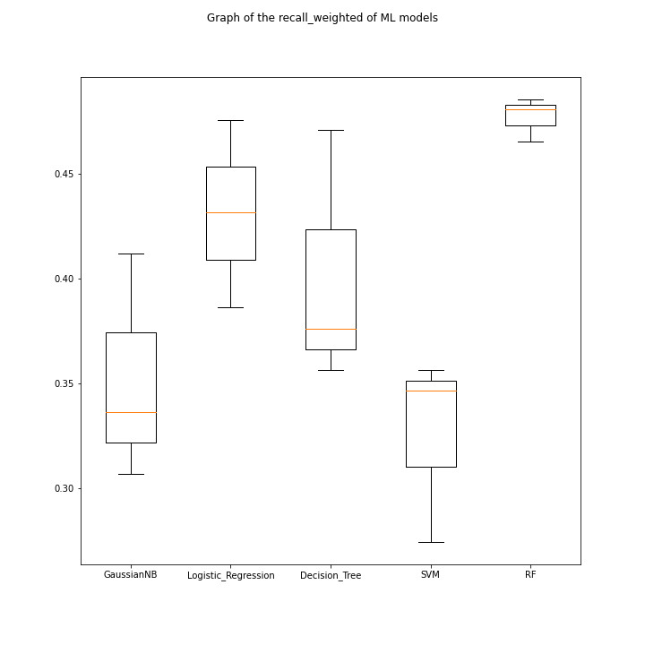

**Лабораторная работа №3**
=
Габитова Элина, ИУ8-82, Вариант №6
-
###
В данной лабораторной работе было необходимо написать программу на языке Python для классификации изображений с покемонами

Были использованы следующие библиотеки:
- sklearn - один из наиболее широко используемых пакетов Python для Data Science
- mahotas - библиотека компьютерного зрения и обработки изображений
- h5py - Работа с файлами формата HDF5
- opencv - работа с изображениями
- numpy - работа с массивами 

Что было проделано:

1.  Установка библиотек sklearn, h5py, mahotas 
2.  Выборка датасета для обработки
2.	Выборка фичей для сравнения изображений:
- HuMoments -  позволяет различать объекты на основании контуров
- Histogram - фича на основе цветовой гистограммы
- Haralick - позволяет различать объекты на основе текстур
3.	Разделение датасета на обучающую и тестовую выборку.
4.	Построение моделей GaussianNB, Logistic Regression, Decision Tree,  SVM, Random Forest (RF)
5.  Визуализация метрик
6.  Определение класса покемона с помощью лучшего классификатора
7.  Подпись покемона на картинке

### Результат работы программы

**KMeans method**
Оценка показателей GaussianNB:

                  precision    recall  f1-score   support

    Сhansey       0.24      0.31       0.27        13
    Grimer        0.33      0.19       0.24        16
    Lickitung     0.64      0.58       0.61        12
    Muk           0.29      0.50       0.37        10
    Slowbro       0.31      0.45       0.37        11
    Slowpoke      0.29      0.13       0.18        15

    accuracy                           0.34        77
    macro avg     0.35      0.36       0.34        77
    weighted avg  0.35      0.34       0.33        77

Оценка показателей Logistic_Regression:

                  precision    recall  f1-score   support

    Chansey       0.78      0.54      0.64        13
    Grimer        0.58      0.44      0.50        16
    Lickitung     0.53      0.83      0.65        12
    Muk           0.45      0.50      0.48        10
    Slowbro       0.36      0.45      0.40        11
    Slowpoke      0.50      0.40      0.44        15

    accuracy                          0.52        77
    macro avg     0.53    0.53        0.52        77
    weighted avg  0.54    0.52        0.52        77

Оценка показателей Decision_Tree:

                   precision    recall  f1-score   support

    Chansey        0.73      0.62      0.67        13
    Grimer         0.30      0.38      0.33        16
    Lickitung      0.20      0.17      0.18        12
    Muk            0.33      0.40      0.36        10
    Slowbro        0.31      0.36      0.33        11
    Slowpoke       0.45      0.33      0.38        15

    accuracy                           0.38        77
    macro avg      0.39      0.38      0.38        77
    weighted avg   0.39      0.38      0.38        77

Оценка показателей SVM:

                  precision    recall  f1-score   support

    Chansey       0.83      0.38      0.53        13
    Grimer        0.67      0.25      0.36        16
    Lickitung     0.43      0.50      0.46        12
    Muk           0.50      0.70      0.58        10
    Slowbro       0.27      0.55      0.36        11
    Slowpoke      0.33      0.33      0.33        15

    accuracy                          0.43        77
    macro avg     0.51      0.45      0.44        77
    weighted avg  0.51      0.43      0.43        77

Оценка показателей RF:

                  precision    recall  f1-score   support

    Chansey       0.69      0.69      0.69        13
    Grimer        0.45      0.31      0.37        16
    Lickitung     0.53      0.67      0.59        12
    Muk           0.39      0.70      0.50        10
    Slowbro       0.36      0.45      0.40        11
    Slowpoke      0.33      0.13      0.19        15

    accuracy                          0.47        77
    macro avg     0.46      0.49      0.46        77
    weighted avg  0.46      0.47      0.45        77

Расчет метрики accuracy:

    GaussianNB: 0.35177635410599883 (0.044117406789529696)
    Logistic_Regression: 0.43091956254448976 (0.0363799706579412)
    Decision_Tree: 0.4010871675402834 (0.04980514310211334)
    SVM: 0.32582670031709055 (0.03651095993430573)
    RF: 0.4769624021225652 (0.008440063906710328)

Расчет метрики precision_weighted:

    GaussianNB: 0.3651390859625014 (0.03054349921814615)
    Logistic_Regression: 0.45415225684254823 (0.044914517276626834)
    Decision_Tree: 0.4326521261959269 (0.05025323384758069)
    SVM: 0.4237593296828544 (0.05766872321621816)
    RF: 0.5769205125543789 (0.00819573325569583)

Расчет метрики recall_weighted:

    GaussianNB: 0.35177635410599883 (0.044117406789529696)
    Logistic_Regression: 0.43091956254448976 (0.0363799706579412)
    Decision_Tree: 0.4010871675402834 (0.04980514310211334)
    SVM: 0.32582670031709055 (0.03651095993430573)
    RF: 0.4769624021225652 (0.008440063906710328)

**Графики:**

**Покемоны:**
Пример распознания покемона:

### Выводы
Из всех алгоритмов наилучшим оказался алгоритм RF, с помощью которого было классифицировано 47% покемонов (по accuracy)
